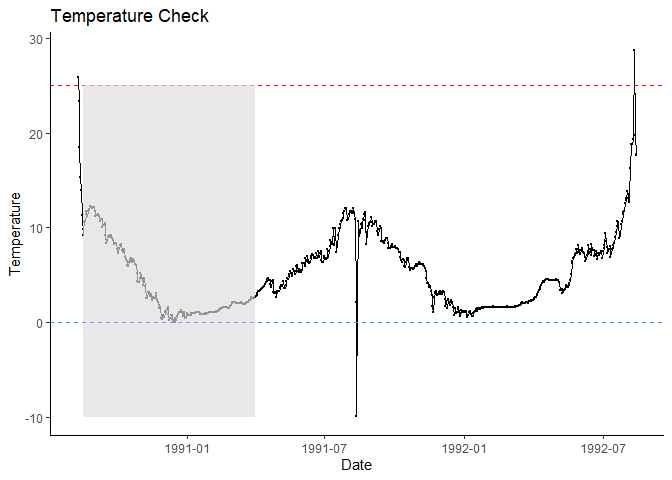
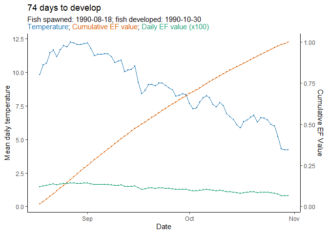

<!-- README.md is generated from README.Rmd. Please edit that file -->

# hatchR: Predict Fish Hatch and Emergence Timing <a href="https://bmait101.github.io/hatchR/"></a>

<!-- badges: start -->

[](https://github.com/bmait101/hatchR/actions/workflows/R-CMD-check.yaml)
<!-- badges: end -->

**hatchR** is an R package for predicting hatch and emergence timing for
a wide range of wild fishes using the effective value framework (Sparks
et al., (2019) <DOI:10.1139/cjfas-2017-0468>). ‘hatchR’ offers users
access to established phenological models and the flexibility to
incorporate custom parameterizations using external datasets. The
package includes functions for model selection, phenology prediction,
and visualization. **hatchR** is designed to be user-friendly and
accessible to a wide range of users, including researchers, managers,
and educators.

## Citation

If you use **hatchR** in a formal publication or report, please cite it.
Citing **hatchR** lets us devote more resources to it in the future.
View the **hatchR** citation by running:

``` r
citation(package = "hatchR")
#> To cite package 'hatchR' in publications use:
#> 
#>   Maitland B, Sparks M, Felts E (2025). "hatchR: A toolset to predict
#>   hatch and emergence phenology in wild fishes." In preparation.
#> 
#> A BibTeX entry for LaTeX users is
#> 
#>   @Unpublished{,
#>     title = {{hatchR}: A toolset to predict hatch and emergence phenology in wild fishes},
#>     author = {Bryan M. Maitland and Morgan M. Sparks and Eli Felts},
#>     year = {2025},
#>     note = {In preparation},
#>   }
```

## Installation Instructions

Install and load the most recent approved version from CRAN by running:

``` r
# install the most recent approved version from CRAN
install.packages("hatchR")
```

Install the development version of **hatchR** from
[GitHub](https://github.com/) by running:

``` r
# install the most recent version from GitHub
pak::pak("bmait101/hatchR")
```

## Interactive Shiny App

You can also use the **hatchR** Shiny app to interactively predict fish
developmental phenology. To run the app, visit the [hatchR Shiny
app](https://elifelts.shinyapps.io/hatchR_demo/).

## Contributing to **hatchR**

We encourage users to report bugs and/or contribute to **hatchR**. For
more detail on how to do this, please see our contributing guide
(`CONTRIBUTING.md`).

## Getting Help

There are several ways to get help with **hatchR**:

1.  Open a GitHub issue [link
    here](https://github.com/bmait101/hatchR/issues).
2.  Post on a support website like Stack Overflow or Cross Validated.

## Example Usage

Below we provide a brief example showing how to use **hatchR**. For a
thorough introduction to the software, see our introductory vignette
[linked
here](https://bmait101.github.io/hatchR/articles/Introduction.html). For
a list of all functions available in **hatchR**, see our function
reference [linked
here](https://bmait101.github.io/hatchR/reference/index.html).

First we load **hatchR** and helper packages by running

``` r
library(hatchR)
library(ggplot2)  # for additional plotting options
library(lubridate)  # for working with dates
```

**hatchR** requires three primary data inputs:

1.  Water temperature data
2.  Species-specific model parameters
3.  Spawning date or date ranges

The example `woody_island` dataset is included in **hatchR** and
contains temperature data from Woody Island, Lake Iliamna, Alaska. It
includes daily water temperature data from 1990-1992. We can use
`plot_check_temp()` to visually check the data. Spawning in this system
typically peaks around August 18 and hatching and emergence are done
before the start of the following spawning season, so we can predict
phenology within a subset of a year. Because `plot_check_temp()` returns
a **ggplot2** object, we can add additional **ggplot2** elements to
customize the plots.

``` r
plot_check_temp(
  data = woody_island,
  dates = date, 
  temperature = temp_c
  ) +  # additional ggplot2 elements below this `+`
  geom_rect(
    aes(
      xmin = ymd("1990-08-18"),  # spawn date
      xmax = ymd("1991-04-01"),  # approx phenology window end
      ymin = -10,  # lower bound
      ymax = 25),  # upper bound
    fill = "grey",
    alpha = 0.01
    ) 
```



Next, select hatch and emerge models we want to use to predict
phenology:

``` r
sockeye_hatch_mod <- model_select(
  author = "Beacham and Murray 1990", 
  species = "sockeye", 
  model = 2, 
  development_type = "hatch"
  )
```

Now we can predict phenology for the sockeye salmon using the
`predict_phenology()` function:

``` r
WI_hatch <- predict_phenology(
  data = woody_island,
  dates = date,
  temperature = temp_c,
  spawn.date = "1990-08-18",
  model = sockeye_hatch_mod
  )
```

We can check the predicted phenology by running:

``` r
# see days to hatch
WI_hatch$days_to_develop
#> [1] 74
# and development period
WI_hatch$dev.period
#>        start       stop
#> 1 1990-08-18 1990-10-30
```

Finally, we can visualize the predicted phenology using
`plot_phenology()`:

``` r
plot_phenology(WI_hatch)
```



## Imported Packages

`hacthR` imports the following **R** packages:

- dplyr: For data manipulation.
- ggplot2: For vignette visualizations.
- lubridate: For working with dates.
- tibble: For creating tibbles as output for various functions.
- rlang: For `.data` usage.
- stats: For various modeling functions (e.g., `confint()`).
- lifecycle: for function lifecycle badges.
- utils: For various utility functions.

## Suggested Packages

**hatchR** suggests the following **R** packages:

- knitr: For vignette building.
- readr: For reading in data.
- purrr: For iteration in vignettes.
- rmarkdown: For vignette building.
- nycflights13: For example data.
- tidyr: For vignette building.
- stringr: For vignette building.
- ggridges: For vignette building.
- patchwork: For vignette building.
- cli: For better messages.
- testthat: For unit testing.

## License

This project is licensed under the GNU General Public License,
[GPL-3](https://cran.r-project.org/web/licenses/GPL-3).

## USDA Disclaimer

**hatchR** project code is provided on an “as is” basis and the user
assumes responsibility for its use. USDA Forest Service has relinquished
control of the information and no longer has responsibility to protect
the integrity , confidentiality, or availability of the information. Any
reference to specific commercial products, processes, or services by
service mark, trademark, manufacturer, or otherwise, does not constitute
or imply their endorsement, recommendation or favoring by USDA Forest
Service.
