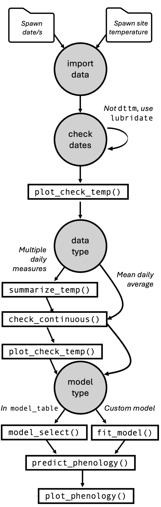

```{r setup, include = FALSE}
# rmd style
knitr::opts_chunk$set(
  collapse = TRUE,
  comment = "#>", 
  warning = FALSE,
  message = FALSE,
  fig.align = 'center',
  fig.width = 6
)
options(tibble.print_min = 5, tibble.print_max = 5)

# load packages
library(hatchR)
library(lubridate)
library(readr)
library(dplyr)
library(nycflights13)
library(tibble)
library(ggplot2)
```

# Overview {#overview}

**hatchR** is an R package that allows users to predict hatch and emergence timing for wild fishes, as well as additional tools to aid in those analyses. **hatchR** is intended to bridge the analytic gap of taking statistical models developed in hatchery settings [*e.g.*, @beacham1990] and applying them to real world temperature data sets using the effective value framework developed by @sparks2019. **hatchR** is also available as an interactive web application at [https://elifelts.shinyapps.io/hatchR_demo/](https://elifelts.shinyapps.io/hatchR_demo/).

**hatchR** is designed to be flexible to achieve many applications. However, by virtue of being built as a scripting application, **hatchR** is able to tackle very large datasets relatively quickly and efficiently. That is, **hatchR** can be used to predict hatch and emergence timing for many fish species across many locations and years. These type of upstream analyses are covered in additional vignettes in this package. In this introductory vignette, we:

-   describes input data requirements
-   provide recommendations for importing data
-   review basic data checks
-   preview the full **hatchR** workflow covered in other vignettes

The generalized workflow for **hatchR**, including the steps below and in subsequent other vignettes, is shown below.

```{r echo = FALSE, out.width = '50%'}

```


# Input Data Requirements {#inputs}

**hatchR** requires three primary data inputs:

1.  Water temperature data
2.  Species-specific model parameters
3.  Spawning date or date ranges

## Water Temperature Data

Water temperature datasets for wild fishes are often either (1) already summarized by day (i.e., mean daily temperature) or, (2) in a raw format from something like a HOBO TidbiT data logger where readings are taken multiple times per day, which can be summarized into a mean daily temperatures. Alternatively, daily water temperature predictions from novel statistical models [*e.g.*, @siegel2023] could be similarly implemented.

Fundamentally, **hatchR** assumes you have input data with two columns:

1.  date: a vector of dates (and often times) of a temperature measurement (must be class `Date` or `POSIXct`, which Tibbles print as \<date\> and \<dttm\>, respectively).
2.  temperature: a vector of associated temperature measurement (**in centigrade**).

Additional columns are allowed, but these are required.

We expect your data to look something like this:

| date       | temperature |
|------------|-------------|
| 2000-01-01 | 2.51        |
| ...        | ...         |
| 2000-07-01 | 16.32       |
| ...        | ...         |
| 2000-12-31 | 3.13        |

**hatchR** assumes you've checked for missing records or errors in your data because ***it can*** work with gaps, so it's important to go through the data checks discussed below, as well as your own validity checks.

**hatchR** can use values down to freezing (*e.g.*, 0 °C), which returns extremely small effective values, and time to hatch or emerge may be \> 1 year. In these cases, we suggest users consider how much of that data type is reasonable with their data. To learn more about this, see the section on [negative temperatures](https://bmait101.github.io/hatchR/articles/Predict_phenology_basic.html#negtemps) in the [Predict fish phenology: Basic](https://bmait101.github.io/hatchR/articles/Predict_phenology_basic.html) vignette.

#### Dates and Times {#date-times}

Numeric temperature values are simple to work with in R, but dates and time can be tricky. Here we provide a brief overview of how to work with dates and times in R, but refer the user to [Chapter 17](https://r4ds.hadley.nz/datetimes.html) in R for Data Science [@wickham2023] for a more in-depth discussion.

The [**lubridate**](https://lubridate.tidyverse.org/) package makes it easier to work with dates and times in R. It comes installed with **hatchR**, and can be loaded with:

```{r, eval = FALSE}
library(lubridate)
```

There are three types of date/time data that refer to an instant in time:

-   A **date**, which Tibbles print as \<date\>
-   A **time** within a day, which Tibbles print as \<time\>
-   A **date-time** is a date plus time, which Tibbles print as \<dttm\>. Base R calls these `POSIXct`, but that's not a helpful name.

You can use `lubridate::today()` or `lubridate::now()` to get the current date or date-time:

```{r}
today()
now()
```

In the context of **hatchR**, the ways you are likely to create a date/time are:

1.  reading a file into R with `readr::read_csv()`
2.  from a string (e.g., if data was read into R with `read.csv()`)
3.  from individual components (year, month, day, hour, minute, second)

#### Reading in dates from a file

When reading in a CSV file with `readr::read_csv()`, `readr` (which also comes installed with **hatchR**) will automatically parse (recognize) dates and date-times if they are in the form "YYYY-MM-DD" or "YYYY-MM-DD HH:MM:SS". These are ISO8601 date (\<date\>) and date-time (\<dttm\>) formats, respectively. ISO8601 is an international standard for writing dates where the components of a date are organized from biggest to smallest separated by -. Below, we first load the `readr` package and then read in a CSV file with dates in the form "YYYY-MM-DD" and "YYYY-MM-DD HH:MM:SS":

```{r, eval=FALSE}
library(readr)
```

```{r}
csv <- "
  date,datetime
  2022-01-02,2022-01-02 05:12
"
read_csv(csv)
```

If your dates are in a different format, you’ll need to use `col_types` plus `col_date()` or `col_datetime()` along with a standard date-time format (see [Table 17.1](https://r4ds.hadley.nz/datetimes.html#tbl-date-formats) in R for Data Science [@wickham2023] for a list of all date format options).

#### From strings

If you read in a CSV file using `read.csv()` from base R, date columns will be formatted as a characters (\<char\>; e.g., `"2000-09-01"` or `"2000-09-01 12:00:00"`). You will have convert to this column to a \<date\> or \<dttm\>. **lubridate** helper functions attempt to automatically determine the format once you specify the order of the component. To use them, identify the order in which year, month, and day appear in your dates, then arrange “y”, “m”, and “d” in the same order. That gives you the name of the **lubridate** function that will parse your date. For date-time, add an underscore and one or more of “h”, “m”, and “s” to the name of the parsing function.

```{r}
ymd("2017-01-31")
mdy("January 31st, 2017")
mdy_hm("01/31/2017 08:01")
ymd_hms("2017-01-31 20:11:59")
```

#### From individual components

Sometimes you have the components of a date in separate columns. You can use `make_date()` or `make_datetime()` to combine them into a date or date-time.

To show this, we'll use the `flights` dataset that comes with **nycflights13**, which is only installed alongside **hatchR** when `dependencies = TRUE` in `install.packages()`. We also make use of helper functions from **dplyr** to `select()` and `mutate()` columns.

```{r, eval=FALSE}
library(nycflights13)
library(dplyr)
```

```{r}
flights |> 
  select(year, month, day) |>
  mutate(date = make_date(year, month, day))

flights |> 
  select(year, month, day, hour, minute) |> 
  mutate(departure = make_datetime(year, month, day, hour, minute))
```

#### Time Zones

Time zones are a complex topic, but we don't need to delve too deep for our purposes. We will cover a few basic topics. For more information, see [Chapter 17](https://r4ds.hadley.nz/datetimes.html) in R for Data Science [@wickham2023].

R uses the international standard IANA time zones. These use a consistent naming scheme {area}/{location}, typically in the form {continent}/{city} or {ocean}/{city}. Examples include “America/New_York”, “Europe/Paris”, and “Pacific/Auckland”.

You can find out what R thinks your current time zone is with `Sys.timezone()`:

```{r}
Sys.timezone()
```

(If R doesn’t know, you’ll get an NA.)

In R, the time zone is an attribute of the date-time that only controls printing. For example, these three objects represent the same instant in time:

```{r}
x1 <- ymd_hms("2024-06-01 12:00:00", tz = "America/New_York")
x1
```

Unless otherwise specified, lubridate always uses UTC. UTC (Coordinated Universal Time) is the standard time zone used by the scientific community and is roughly equivalent to GMT (Greenwich Mean Time). It does not have DST, which makes a convenient representation for computation. Thus `read_csv()` converts to UTC, so if times are shifted, then daily summaries can be incorrect. This only matters if data are not daily yet, `as.posixct()` sets to local time.

You can change the time zone in two ways:

1.  Change the time zone attribute with `force_tz()`
2.  Change the time zone for printing with `with_tz()`


## Importing water temperature data {#data-in}

### Using `readr::read_csv()`

We recommend loading your data into R using `readr::read_csv()`. We can load readr using:

```{r, eval=FALSE}
library(readr)
```

In this and other vignettes, we will use two datasets that come installed with the package: `crooked_river` and `woody_island`. Each dataset is available to the user as R objects once **hatchR** is installed and attached (see `?crooked_river` or `?woody_island` for more information). The raw example data (.csv files) are stored in the `extdata/` directory installed alongside **hatchR**. We may store the file paths to example data:

```{r}
path_cr <- system.file("extdata/crooked_river.csv", package = "hatchR")
path_wi <- system.file("extdata/woody_island.csv", package = "hatchR")
```

After specifying `path_*` (using `system.file()`), we load the example dataset into R:

```{r}
crooked_river <- read_csv(path_cr)
woody_island <- read_csv(path_wi)
```

We check the `crooked_river` dataset by running either `str()` or `tibble::glimpse()` to see the structure of the data. `glimpse()` is a little like `str()` applied to a data frame, but it tries to show you as much data as possible. We prefer `tibble::glimpse()` because it is more compact and easier to read. **tibble** also comes installed with **hatchR**.

```{r, eval=FALSE}
library(tibble)
```

Now we can check the structure of the `crooked_river` dataset:

```{r}
glimpse(crooked_river)
glimpse(woody_island)
```

For your own data, assuming you have a .csv file in a `data` folder in your working directory called `your_data.csv`, you would call:

```{r, eval=FALSE}
library(readr)
library(tibble)
your_data <- read_csv("data/your_data.csv")
glimpse(your_data)
```

### Using `read.csv()`

If you import your data in with functions like `read.csv()` or `read.table()`, date columns will be formatted as a characters (\<chr\>). You will have convert to this column to a \<date\> or \<dttm\> type, and we recommend you do this using **lubridate**, which makes dealing with date a litter easier.

Below is an example of how you might do this. First, we check the structure of the `crooked_river` and `woody_island` datasets:

```{r}
crooked_river <- read.csv(path_cr)
woody_island <- read.csv(path_wi)

glimpse(crooked_river) # note date column imported as a character (<chr>)
glimpse(woody_island) # note date column imported as a character (<chr>)
```

Then, we convert the date columns using **lubridate**:

```{r}
# if your date is in the form "2000-09-01 12:00:00"
crooked_river$date <- ymd_hms(crooked_river$date)

# if your date is in the form "2000-09-01"
woody_island$date <- mdy(woody_island$date) 

glimpse(crooked_river)
glimpse(woody_island)
```

## Temperature data checks {#data-checks}

After data are loaded and dates are formatted correctly, we can complete a series of checks to ensure that the temperature data is in the correct format and that there are no missing values.

**hatchR** provides several helper functions to assist with this process.

```{r, eval = FALSE}
library(hatchR)
```

## Visualize your temperature data {#viz-data}

**hatchR** comes with the function `plot_check_temp()` to visualize your imported data and verify nothing strange happened during your import process. The function outputs a **ggplot2** object which can be subsequently modified by the user. The arguments `temp_min =` and `temp_max =` can be used to custom set thresholds for expected temperature ranges (defaults are set at 0 and 25 °C). Here is an example using the built-in dataset `crooked_river`:

```{r}
plot_check_temp(data = crooked_river, 
                dates = date, 
                temperature = temp_c, 
                temp_min = 0, 
                temp_max = 12)
```

## Summarize temperature data {#summarize-data}

If you imported raw data with multiple recordings per day, **hatchR** has a built in function to summarize those data to a daily average mean called `summarize_temp()`. The output of the function is a tibble with mean daily temperature and its corresponding.

Below, we simulate a dataset with 30-minute temperature recordings for a year and summarize the data to daily means.

```{r}
# set seed for reproducibility
set.seed(123)

# create vector of date-times for a year at 30 minute intervals
dates <- seq(
  from = ymd_hms("2000-01-01 00:00:00"),
  to = ymd_hms("2000-12-31 23:59:59"), 
  by = "30 min"
  )

# simulate temperature data
fake_data <- tibble(
  date = dates,
  temp = rnorm(n = length(dates), mean = 10, sd = 3) |> abs()
)

# check it
glimpse(fake_data)
```

Now we can summarize the data to daily means using `summarize_temp()`:

```{r}
fake_data_sum <- summarize_temp(data = fake_data,
                                temperature = temp,
                                dates = date)

nrow(fake_data) #17568 records
nrow(fake_data_sum) #366 records; 2000 was a leap year :)
```

We again recommend, at a minimum, visually checking your data once it has been summarized.

```{r}
# note we use fake_data_sum instead of fake_data
plot_check_temp(data = fake_data_sum, 
                dates = date, 
                temperature = daily_temp, 
                temp_min = 5,
                temp_max = 15)
```

## Check for continuous data {#check-continuous}

At present, **hatchR** only uses continuous data. Therefore, your data is expected to be continuous and complete.

You can check whether your data is complete and continuous using the `check_continuous()` function. This function will return a message if the data is or is not continuous or complete. Below, the calls return all clear:

```{r, warning=TRUE, message=TRUE}
check_continuous(data = crooked_river, dates = date)
check_continuous(data = woody_island, dates = date)
```

But if you had breaks in your data:

```{r, warning=TRUE, message=TRUE}
check_continuous(data = crooked_river[-5,], dates = date)
```

You'll get a note providing the row index where breaks are found for inspection.

If you have days of missing data, you could impute them using rolling means or other approaches.


## Species-specific model parameters {#species-params}

**hatchR** has two options for selecting parameterized models for predicting fish early life history phenology using:

1.  model parameterizations included in the package
2.  custom parameterizations using your own data

This processes is described in the vignette [Parameterize hatchR models](https://bmait101.github.io/hatchR/articles/Parameterize_models.html)


## Spawn Dates {#spawn-dates}

A date or range of dates for spawning the species of interest is required to predict phenology. This information can be provided in the form of a single date or a range of dates. More information on how to provide this information is available in the vignette [Predict phenology: basic](https://bmait101.github.io/hatchR/articles/Predict_phenology_basic.html), as well as subsequent vignettes.


# Next steps

After importing, wrangling, and checking your temperature data, there are a number of different actions you can take. These steps are laid out in subsequent vignettes:

-   [Parameterize hatchR models](https://bmait101.github.io/hatchR/articles/Parameterize_models.html)
-   [Predict phenology: basic](https://bmait101.github.io/hatchR/articles/Predict_phenology_basic.html)
-   [Predict phenology: advanced](https://bmait101.github.io/hatchR/articles/Predict_phenology_advanced.html)
-   [Predict phenology: nested](https://bmait101.github.io/hatchR/articles/Predict_phenology_nested.html)
-   [Advanced plotting](https://bmait101.github.io/hatchR/articles/Advanced_plotting.html).

# References {.unnumbered}
