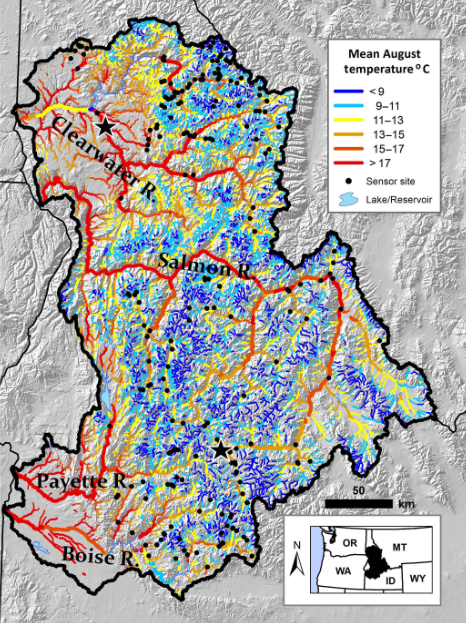

```{r setup, include = FALSE}
# rmd style
knitr::opts_chunk$set(
  collapse = TRUE,
  comment = "#>",
  warning = FALSE,
  message = FALSE,
  fig.align = "center",
  fig.width = 6
)
options(tibble.print_min = 5, tibble.print_max = 5)

# load packages
library(hatchR)
library(dplyr)
library(lubridate)
library(tidyr)
library(purrr)
library(ggplot2)
library(ggridges)
```

# Overview

**hatchR** is designed to be flexible to achieve many applications. However, by virtue of being built as a scripting application, **hatchR** is able to tackle very large datasets relatively quickly and efficiently. Below we demonstrate an example of a nested dataset with multiple sites that include multiple years of data.

First, we load packages:

```{r, eval=FALSE}
library(hatchR)
library(purrr)      # for mapping functions
library(tidyr)      # for nesting data
library(dplyr)      # for data manipulation
library(lubridate)  # for date manipulation
library(ggplot2)    # for plotting
library(ggridges)   # for plotting
```

## Example Data

We'll use a dataset of water temperature data from Central Idaho. These data are downloaded (and modified to long format) from @isaak2018 and generally cover the Boise, Payette, Clearwater, and upper Salmon River watersheds. The map below shows the locations of 226 water temperature monitoring sites overlaid on an August stream temperature scenario for the 29 600 km network in the study area.

```{r, echo = FALSE, out.height='70%'}

```

To get started lets take a quick look at the data.

```{r}
# look at the first few rows
idaho

# count number of unique sites
idaho |> 
  pull(site) |>
  unique() |> 
  length()
```

You can see there are 226 sites with 773,681 individual records of water temperature.

For this application, we'll be thinking about these sites at putative bull trout (*Salvelinus confluentus*) spawning habitat. Bull trout are generally not observed where mean August temperatures are above 13 °C. So, we'll first filter sites out for those cooler than 13 °C.

```{r}
# create a vector of site names with temps at or below 13 C
bull_trout_sites <- idaho |> 
  mutate(month = month(date)) |> #make a month column (numeric)
  filter(month == 8) |> # filter out Aug.
  group_by(site) |> # apply grouping by site
  summarise(mean_aug_temp = mean(temp_c)) |> 
  filter(mean_aug_temp <= 13) |> # keep only sites 13 C or cooler
  pull(site) |> 
  unique()

# we now have a list of 139 sites
length(bull_trout_sites)

# only keep sites in our vector of bull trout sites
idaho_bt <- idaho |> 
  filter(site %in% bull_trout_sites) 

# still lots of data!
idaho_bt
```

Next we'll want to do some data checks to make sure everything looks alright.

```{r}
# lets look at a couple individual sites
PIBO_1345 <- idaho_bt |> filter(site == "PIBO_1345")

# looks nice
plot_check_temp(PIBO_1345,
                dates = date,
                temperature = temp_c)

# order by sample date
PIBO_1345 |> arrange(date)
# looks like there are multiple records per day 
# so we need to summarize those in the larger dataset (idaho_bt)

```

# Nested Dataframes

The package **tidyr** allows us to use a functionality called nested data (`tidyr::nest()`). For our datatset, we can think of it in terms of a dataframe made up of a bunch of smaller dataframes where the identifier for separating the data is the name in the `site` column. These sub dataframes then are the records for each site in our example and we can separate them to programatically so that we can use the same function across them without skipping into the next data field. It utilizes the same approach we applied with `purrr::map()` but allows us to separate the function across individual datasets stored in our larger dataframe.

In this first example we want to summarize our data by day, which we can do using the following code.

First let's just look at what nesting does before we actually make an object.

```{r}
idaho_bt |> 
  group_by(site) |>  # we group by site
  nest() |> # nest our grouped data
  head()
```

The resulting data structure is tibble with a new data column called data. The data column is actually a list and each row contains its own individual tibble (dataframe).

```{r}
isaak_summ_bt <- idaho_bt |> 
  group_by(site) |> 
  nest() |> 
  mutate(
    summ_obj = map(
      data, 
      summarize_temp,
      temperature = temp_c,
      dates = date
      )
    ) |> 
  select(site, summ_obj) 

# look at first rows of full object
isaak_summ_bt

# use purrr::pluck() the first site to see its structure
isaak_summ_bt |> pluck("summ_obj", 1)
```

Since we'll be operating on these as nests we will keep them as a nest, however if you wanted to change back to the original dataframe format it's easy with `tidyr::unnest()`.

```{r}
isaak_summ_bt |> unnest(cols = summ_obj)
```

## Data Check

We can do a last data check to make sure we have continuous data.

First we'll use a smaller example to show how it works and then expand to our full dataset.

```{r}
# Pull data from one sits
PIBO_1345_summ <- isaak_summ_bt |>
  filter(site == "PIBO_1345") |>
  unnest(cols = "summ_obj")

# We create a column that either contains NA, TRUE, or FALSE
#   NA is for first data
#   TRUE is if the difference between one row and the row preceding it is 1
#   FALSE is the difference is not 1
PIBO_1345_summ |>
  mutate(diff = c(NA, diff(date)) == 1) |>
  filter(diff == FALSE) # since the output is empty there are no FALSE in diff

# We can do the same to our isaak_summ_bt dataset
#   only difference here is we are mapping with an anonymous function hence the
#   ~{..., .x$date...} syntax. 
#   ~{} tells us it's an anonymous function while the .x allows to us to 
#   call the column from whatever data is piped in
isaak_summ_bt |>
  mutate(diff = map(
    summ_obj, ~ {
      c(NA, diff(.x$date) == 1) 
      }
    )
    ) |>
  unnest(cols = c(summ_obj, diff)) |>
  filter(diff == FALSE) 
# all continuous!
```

## Mapping Across Nested Data

Now that we have our data in the format we want and we're confident that it doesn't have any gaps we can start to map our **hatchR** functions onto the data.

First we need to make a vector of spawn dates and get our model set up.

```{r}
# spawn dataest
spawn_dates <- map(
  c(2011:2014), # year vector to map for custom function
  function(year) { # custom paste function
    c(
      paste0(year, "-09-01"),
      paste0(year, "-09-15"),
      paste0(year, "-09-30")
      )
    }
  ) |> 
  unlist()

# bull trout hatch model
bt_hatch <- model_select(
  development_type = "hatch",
  author = "Austin et al. 2019",
  species = "bull trout",
  model = "MM"
)
```

Then we can map it across our nested dataframe.

```{r}
hatch_res <- isaak_summ_bt |> 
  mutate(
    dev_period = map2(
      summ_obj, spawn_dates, 
      predict_phenology,
      temperature = daily_temp,
      model = bt_hatch,
      dates = date
      ) |> 
      map_df("dev.period") |>
      list()
    ) |> 
  select(site, dev_period) |> # just select the columns we want
  unnest(cols = c(dev_period)) |> # unnest everything
  mutate(days_to_hatch = stop - start) # make a new column of days to hatch

hatch_res
```

> It's not output here, but this will output a boatload of warnings that some fish aren't hatching. However, it's pretty safe to assume that some of these habitats are actually too cold for bull trout and those are the places where they won't have hatched. If we were trying to make management decisions about these fish or testing a some kind of hypothesis it would be worth following up with why those fish weren't hatching, but for now, we'll rest on the assumption it's just too cold.

A couple notes about what we did above. First we use `purrr::map2()` instead of `purrr::pmap()` but they are interchangeable here as long as you set up your variable grid for `purrr::pmap()`. Secondly, we're actually piping the output of the `purrr::map2()` into `purrr::map_df()` function so we can just pull out the `dev.period` list element out of the `predict_phenology()` output. Otherwise we'd end up with a list of the 4 outputs from `predict_phenology()`, which would end up being a pretty big object in your memory. So better just to store the 1x2 vector that is `dev.period`. Lastly, the `purrr::map_df()` is piped into a list because the nested dataframe doesn't know how to hold onto multiple dimension object (the 1x2 vector), it just wants a singular list containing all the elements.

With that in mind we can plot our data.

Briefly, we'll add an extra set of columns to define whether a fish spawned early, mid, or late and then plot the distributions across those time periods.

```{r}
hatch_res |>
  mutate(day = day(start)) |> 
  mutate(spawn_time = case_when(
    day == 1 ~ "Early",
    day == 15 ~ "Mid",
    day == 30 ~ "Late"
  )) |>
  mutate(spawn_time = factor(
    spawn_time, levels = c("Late", "Mid", "Early"), 
    ordered = TRUE)
    ) |> 
  ggplot(aes(
    x = as.integer(days_to_hatch), 
    y = spawn_time, 
    fill = spawn_time, 
    color = spawn_time
    )) + 
  geom_density_ridges(alpha = 0.9) +
  scale_fill_brewer(palette = "Blues", direction = 1) +
  scale_color_brewer(palette = "Blues", direction = 1) +
  labs(x = "Days to hatch", y = "Spawn time") +
  theme_classic() +
  theme(legend.position = "none")
```

# References {.unnumbered}
